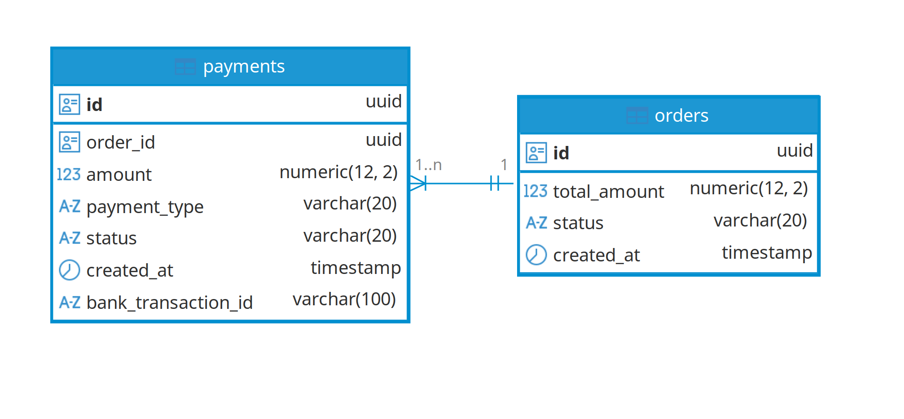

# Payment Service

Микросервис для управления заказами и платежами с интеграцией банковского эквайринга.

## 🚀 Стек технологий
- **Python 3.12** + **FastAPI** (Асинхронный веб-фреймворк)
- **PostgreSQL** + **SQLAlchemy 2.0** (Async API)
- **Alembic** (Миграции базы данных)
- **Pydantic V2** (Валидация данных и схем)
- **Docker** & **Docker Compose** (Контейнеризация)

## 🛠 Архитектурные решения
1. **Service Layer**: Вся бизнес-логика (расчет остатков, смена статусов, проверки переплат) вынесена в `app/services/payment_service.py`. Это позволяет вызывать операции (депозит/возврат) независимо от веб-слоя (API).
2. **Bank Client (Adapter)**: Интеграция с банком реализована через абстракцию `app/core/bank_client.py`. В коде реализованы методы для ресурсов 2.1 (start) и 2.2 (check).
3. **Целостность данных**: Используется стратегия `selectinload` для подгрузки связанных платежей заказа одним запросом, что исключает ошибки N+1 и Race Condition при расчете баланса в асинхронной среде.
4. **Статусная модель**: Реализовано автоматическое согласование статусов заказа (`new` -> `partially_paid` -> `paid`) и их «откат» при оформлении возвратов.

## 📊 Схема базы данных


## 📦 Запуск проекта
1. Убедитесь, что у вас установлен Docker и Docker Compose.
2. Соберите и запустите контейнеры:
   ```bash
   docker compose up --build